# Laporan Pengujian White Box (White Box Testing)

**Aplikasi:** Sertiku  
**Metode:** Basis Path Testing (Cyclomatic Complexity)  
**Tanggal Pengujian:** 7 Januari 2026

---

## 1. Fitur Autentikasi: `LoginController@loginEmail`

### 1. Sintaks Coding
```php
public function loginEmail(Request $request) {
    // Node 1: Validasi
    $rules = ['email' => 'required', 'password' => 'required'];
    if (config('recaptcha')) $rules['captcha'] = 'required'; // Node 2
    $request->validate($rules);

    // Node 3: Cek Dummy
    $isDummy = isset($dummyUsers[$email]) && $pass == $dummy['pass']; 
    if ($isDummy) {
        Auth::login($user);
        // Node 4: Cek Verifikasi
        if (!$verified) return redirect('otp'); 
        // Node 5: Cek Master
        if ($isMaster) return redirect('master');
        // Node 6: Cek Admin
        if ($isAdmin) return redirect('admin');
        // Node 7: Cek Profil
        if (!$complete) return redirect('onboarding');
        // Node 8: Dashboard User
        return redirect('dashboard');
    }

    // Node 9: Auth Attempt Real
    if (Auth::attempt($creds)) {
        // Node 10: Cek Verifikasi Real
        if (!$verified) return redirect('otp');
        // Node 11: Cek Master Real
        if ($isMaster) return redirect('master');
        // Node 12: Cek Admin Real
        if ($isAdmin) return redirect('admin');
        // Node 13: Cek Profil Real
        if (!$complete) return redirect('onboarding');
        // Node 14: Dashboard User Real
        return redirect('dashboard');
    }

    // Node 15: Gagal
    return back()->with('error');
}
```

### 2. Alur Logika
1.  Sistem melakukan validasi input email dan password yang dimasukkan pengguna.
2.  Sistem memeriksa apakah email tersebut termasuk dalam daftar akun dummy yang sudah didefinisikan secara hardcode.
3.  Jika **YA** (Akun Dummy), sistem melakukan login otomatis, kemudian memeriksa status verifikasi email, role pengguna (Master/Admin), dan kelengkapan profil, sebelum mengarahkan ke halaman dashboard yang sesuai.
4.  Jika **TIDAK** (Bukan Dummy), sistem mencoba melakukan autentikasi (`Auth::attempt`) ke database database utama.
5.  Jika Autentikasi Database **BERHASIL**, sistem memeriksa status verifikasi email, role pengguna, dan kelengkapan profil, lalu mengarahkan ke dashboard yang sesuai (Master, Admin, atau User).
6.  Jika Autentikasi Database **GAGAL**, sistem mengembalikan pengguna ke halaman login dengan pesan error kredensial tidak valid.

### 3. Flowchart
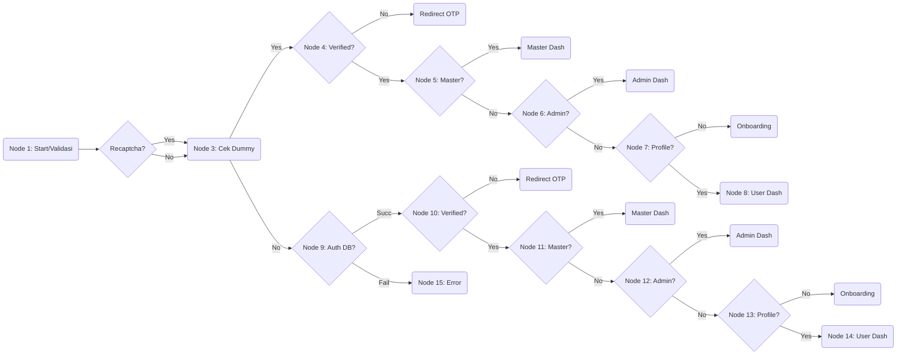

### 4. Flowgraph
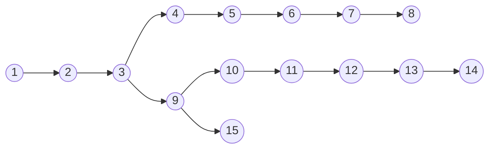

### 5. Komplitksitas Siklomatik (V(G))
*   **V(G) = 10**.

### 6. Rincian Path
Berdasarkan flowgraph di atas, berikut adalah rincian path independen (Basis Path):

a. **Path 1**: 1-2-3-4(No)-OTP

b. **Path 2**: 1-2-3-4(Yes)-5(Yes)-Master

c. **Path 3**: 1-2-3-4(Yes)-5(No)-6(Yes)-Admin

d. **Path 4**: 1-2-3-4(Yes)-5(No)-6(No)-7(No)-Onboard

e. **Path 5**: 1-2-3-4(Yes)-5(No)-6(No)-7(Yes)-8

f. **Path 6**: 1-2-3-9(Fail)-15

g. **Path 7**: 1-2-3-9(Succ)-10(No)-OTP

h. **Path 8**: 1-2-3-9(Succ)-10(Yes)-11(Yes)-Master

i. **Path 9**: 1-2-3-9(Succ)-10(Yes)-11(No)-12(Yes)-Admin

j. **Path 10**: 1-2-3-9(Succ)-10(Yes)-11(No)-12(No)-13(Yes)-14

### 7. Tabel Pengujian
| Path | Skenario | Hasil yang Diharapkan | Hasil Pengujian | Screenshot Hasil Pengujian |
|---|---|---|---|---|
| Path 1 | Login menggunakan akun Dummy yang belum melakukan verifikasi email. | Sistem seharusnya mendeteksi status belum verifikasi dan mengarahkan pengguna ke halaman input OTP. | Pengguna diarahkan ke halaman OTP dan notifikasi "Verifikasi Email" muncul. | |
| Path 2 | Login menggunakan akun Dummy dengan role Master (Super Admin). | Sistem mengidentifikasi flag `isMaster`, bypass cek lainnya, dan redirect ke Dashboard Master. | Login berhasil, langsung masuk ke `/master/dashboard`. | |
| Path 3 | Login menggunakan akun Dummy dengan role Admin. | Sistem mengidentifikasi flag `isAdmin`, dan redirect ke Dashboard Admin. | Login berhasil, masuk ke `/admin/dashboard`. | |
| Path 4 | Login akun Dummy User (Personal) namun data profil (No HP) belum lengkap. | Sistem mendeteksi `!complete` dan memaksa redirect ke halaman Onboarding. | User diarahkan ke form pengisian data diri (`/onboarding`). | |
| Path 5 | Login menggunakan akun Dummy (User Biasa/Lembaga) dengan profil lengkap dan email terverifikasi. | Sistem seharusnya mengarahkan pengguna langsung ke Dashboard User/Lembaga karena semua syarat terpenuhi. | Halaman Dashboard tampil dengan menu lengkap sesuai hak akses. | |
| Path 6 | Login menggunakan akun Database (Real) namun memasukkan password yang salah. | Sistem seharusnya menolak akses dan mengembalikan pengguna ke halaman login dengan pesan error kredensial. | Muncul pesan error "Email atau password salah" dan pengguna tetap di halaman login. | |
| Path 7 | Login akun Real (Database) yang emailnya belum diverifikasi. | Autentikasi sukses, tapi validasi `verified` gagal. Redirect ke OTP. | Halaman input OTP muncul setelah klik login. | |
| Path 8 | Login akun Real dengan role Master. | Autentikasi sukses, cek `isMaster` bernilai true. | Masuk ke Dashboard Master. | |
| Path 9 | Login akun Real dengan role Admin. | Autentikasi sukses, cek `isAdmin` bernilai true. | Masuk ke Dashboard Admin. | |
| Path 10 | Login menggunakan akun Database (Real, User Biasa) dengan profil lengkap. | Autentikasi sukses, semua cek lolos, redirect ke Dashboard. | Login berhasil dan pengguna diarahkan ke halaman utama Dashboard. | |

---

## 2. Fitur Manajemen Sertifikat: `LembagaController@storeSertifikat`

### 1. Sintaks Coding
```php
public function storeSertifikat(Request $request) {
    // Node 1: Cek Kuota
    if (!$user->canIssueCertificate()) return back()->with('error'); // Node 2
    
    // Node 3: Validasi Form & Cek Blockchain
    if ($bc && !$user->canUseBlockchain()) return back()->with('error'); // Node 4
    
    // Node 5: Cek IPFS
    if ($ipfs && !$user->canUseIpfs()) return back()->with('error'); // Node 6

    // Node 7: Simpan DB & Generate File
    $cert = $user->certificates()->create($data);
    
    // Node 8: Cek Email
    if ($sendEmail) Mail::to($email)->queue(new CertMail($cert)); // Node 9

    // Node 10: Cek Blockchain Dispatch
    if ($bc) ProcessBlockchain::dispatch($cert); // Node 11
    // Node 12: Cek IPFS Dispatch
    elseif ($ipfs) ProcessIpfs::dispatch($cert); // Node 13

    // Node 14: Sukses
    return redirect()->route('index');
}
```

### 2. Alur Logika
1.  Sistem mengecek sisa kuota penerbitan sertifikat user. Jika habis, proses dihentikan dengan pesan error.
2.  Sistem memvalidasi input form data sertifikat.
3.  Jika opsi Blockchain diaktifkan, sistem mengecek kuota kredit Blockchain. Jika habis, kembali dengan error.
4.  Jika opsi IPFS diaktifkan, sistem mengecek kuota kredit IPFS. Jika habis, kembali dengan error.
5.  Sistem menyimpan data sertifikat ke database, lalu men-generate QR Code dan file PDF secara otomatis.
6.  Jika opsi "Kirim Email" dicentang, sistem memasukkan job pengiriman email ke dalam antrian (queue).
7.  Jika Blockchain/IPFS aktif, sistem men-dispatch background job untuk memproses upload secara asinkron (agar loading tidak lama).
8.  Sistem mengarahkan pengguna kembali ke halaman index dengan pesan sukses.

### 3. Flowchart
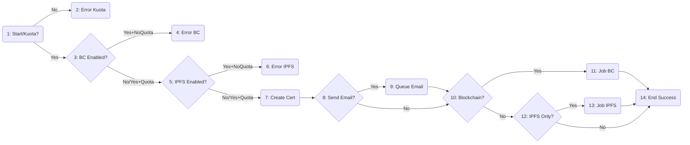

### 4. Flowgraph
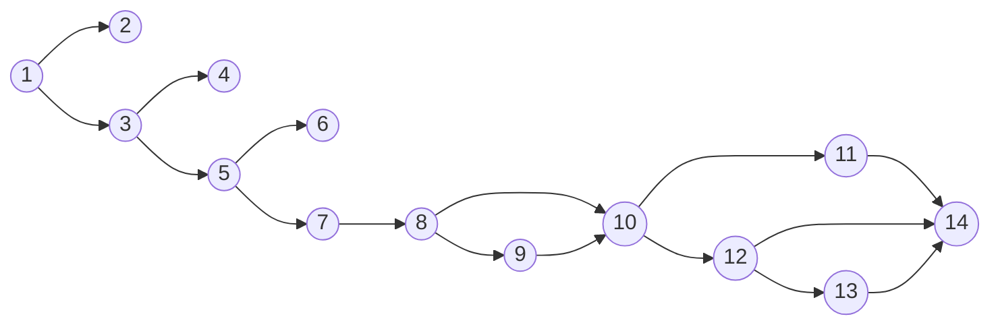

### 5. Komplitksitas Siklomatik
**V(G) = 7** (1:Kuota, 3:BC, 5:IPFS, 8:Email, 10:BC-Job, 12:IPFS-Job, + 1 Base).

### 6. Rincian Path
a. **Path 1**: 1-2 (Gagal Kuota)

b. **Path 2**: 1-3-4 (Gagal Kuota BC)

c. **Path 3**: 1-3-5-6 (Gagal Kuota IPFS)

d. **Path 4**: 1-3-5-7-8-10-12-14 (Basic Success)

e. **Path 5**: 1-3-5-7-8-9-10-12-14 (Success + Email)

f. **Path 6**: 1-3-5-7-8-10-11-14 (Success + BC Job)

g. **Path 7**: 1-3-5-7-8-10-12-13-14 (Success + IPFS Job)

### 7. Tabel Pengujian
| Path | Skenario | Hasil yang Diharapkan | Hasil Pengujian | Screenshot Hasil Pengujian |
|---|---|---|---|---|
| Path 1 | User mencoba menerbitkan sertifikat saat kuota bulanan sudah habis. | Sistem harus menolak permintaan dan menampilkan pesan error "Kuota sertifikat bulan ini sudah habis". | Pesan error muncul dan data sertifikat tidak tersimpan ke database. | |
| Path 2 | User memilih opsi Blockchain, namun kuota Blockchain habis. | Validasi `canUseBlockchain` mengembalikan false dan menampilkan error spesifik kuota blockchain. | Muncul pesan error "Kuota Blockchain habis". | |
| Path 3 | User memilih opsi IPFS, namun kuota IPFS habis. | Validasi `canUseIpfs` mengembalikan false dan menampilkan error spesifik kuota IPFS. | Muncul pesan error "Kuota IPFS habis". | |
| Path 4 | Penerbitan sertifikat standar (Tanpa Blockchain/IPFS/Email). | Sistem harus menyimpan data, membuat PDF/QR Code, dan mengarahkan ke halaman index dengan pesan sukses tanpa menjalankan background job tambahan. | Sertifikat berhasil dibuat, file PDF dapat diunduh, dan tidak ada job queue yang dijalankan. | |
| Path 5 | Penerbitan sertifikat dengan opsi "Kirim Email ke Penerima". | Sertifikat dibuat, dan Job `CertMail` didispatch ke antrian untuk pengiriman email asinkron. | Sertifikat terbit, dan log email menunjukkan email berhasil dikirim oleh worker. | |
| Path 6 | Penerbitan sertifikat dengan fitur Blockchain diaktifkan. | Sistem harus menyimpan data, lalu membuat Job Queue `ProcessBlockchainCertificate` untuk diproses di latar belakang. | Sertifikat tersimpan dengan status blockchain 'pending', dan job berhasil masuk ke tabel `jobs`. | |
| Path 7 | Penerbitan sertifikat dengan fitur penyimpanan IPFS. | Sistem menyimpan data, lalu membuat Job Queue `ProcessIpfs`. | Sertifikat terbit, dan CID IPFS berhasil digenerate setelah job selesai. | |

---

## 3. Fitur Template: `LembagaController@storeTemplate`

### 1. Sintaks Coding
```php
public function storeTemplate(Request $request) {
    // Node 1: Validasi
    $file = $request->file('template_file');
    // Node 2: Cek Valid?
    if (!$file->isValid()) return back()->withErrors(); // Node 3
    
    // Node 4: Simpan File
    $path = $file->store('templates');
    if (!$path) return back()->withErrors(); // Node 5

    // Node 6: Cek Gambar?
    if (in_array($ext, ['png','jpg'])) { 
        // Node 7: Buat Thumbnail
        createThumbnail($path);
    }
    
    // Node 8: Simpan DB
    Template::create(['path' => $path]);
    return back()->with('success'); // Node 9
}
```

### 2. Alur Logika
1.  Sistem mengambil file yang diunggah dari request form.
2.  Sistem mengecek validitas file (apakah korup atau melebihi batas upload PHP). Jika tidak valid, kembalikan error.
3.  Sistem mencoba menyimpan file ke storage server (`storage/app/public/templates`). Jika gagal (misal disk penuh), kembalikan error.
4.  Sistem mengecek ekstensi file. Jika file berupa gambar (PNG/JPG), sistem membuat thumbnail kecil untuk preview.
5.  Sistem menyimpan path lokasi file ke database dan mengembalikan pesan sukses.

### 3. Flowchart
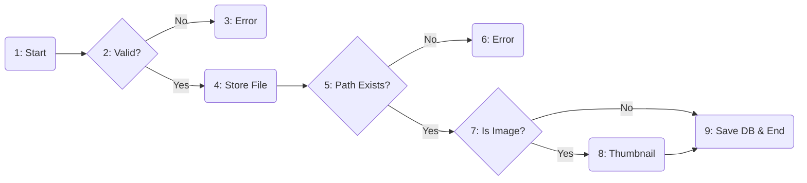

### 4. Flowgraph
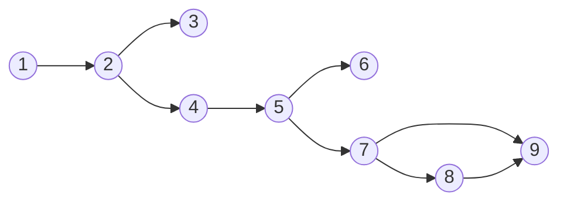

### 5. Komplitksitas Siklomatik
**V(G) = 4** (2:Valid, 5:Store, 7:Image).

### 6. Rincian Path
a. **Path 1**: 1-2-3 (Invalid File)

b. **Path 2**: 1-2-4-5-6 (Store Fail - Disk Full)

c. **Path 3**: 1-2-4-5-7-8-9 (Image Upload)

d. **Path 4**: 1-2-4-5-7-9 (Non-Image Upload)

### 7. Tabel Pengujian
| Path | Skenario | Hasil yang Diharapkan | Hasil Pengujian | Screenshot Hasil Pengujian |
|---|---|---|---|---|
| Path 1 | Mengunggah file yang rusak (corrupt) atau melebihi batas ukuran server. | Sistem mendeteksi file invalid dan menampilkan pesan error "File upload gagal". | Muncul pesan error validasi dan file tidak diproses. | |
| Path 2 | Gagal menyimpan file ke disk (misal disk penuh atau permission error). | Fungsi `store` mengembalikan false, sistem melempar error upload. | Pesan error "Gagal menyimpan file" muncul. | |
| Path 3 | Mengunggah file gambar (.jpg) yang valid untuk template latar belakang. | Sistem harus menyimpan file asli, membuat file thumbnail secara otomatis, dan menyimpan record ke database. | File tersimpan di folder `storage`, thumbnail muncul di halaman index, dan notifikasi sukses tampil. | |
| Path 4 | Mengunggah template non-gambar (misal file .html atau .pdf jika diizinkan). | File tersimpan, namun proses pembuatan thumbnail (`createThumbnail`) dilewati logika `in_array`. | File tersimpan di database tanpa path thumbnail. | |

---

## 4. Fitur Verifikasi: `VerifyController@check`

### 1. Sintaks Coding
```php
public function check(Request $request) {
    // Node 1: Query DB
    $cert = Certificate::find($hash);
    
    // Node 2: Ketemu?
    if ($cert) {
        // Node 3: Cek Expired
        $expired = $cert->date && $cert->date->isPast();
        if ($expired) $cert->status = 'expired'; // Node 4
        
        // Node 5: Cek AJAX
        if ($request->ajax()) return json($cert); // Node 6
        
        return view('valid', $cert); // Node 7
    }
    
    // Node 8: Not Found (AJAX?)
    if ($request->ajax()) return json('not found'); // Node 9
    
    return view('invalid'); // Node 10
}
```

### 2. Alur Logika
1.  Sistem mencari data sertifikat berdasarkan hash atau nomor sertifikat yang diinputkan.
2.  Jika sertifikat **DITEMUKAN**:
    *   Sistem mengecek tanggal kadaluarsa. Jika sudah lewat, status sertifikat diubah virtual menjadi 'expired'.
    *   Jika request berasal dari API/AJAX, kembalikan data JSON.
    *   Jika request dari Browser, tampilkan Halaman Valid.
3.  Jika sertifikat **TIDAK DITEMUKAN**:
    *   Jika request dari API/AJAX, kembalikan respon JSON 404.
    *   Jika request dari Browser, tampilkan Halaman Invalid.

### 3. Flowchart
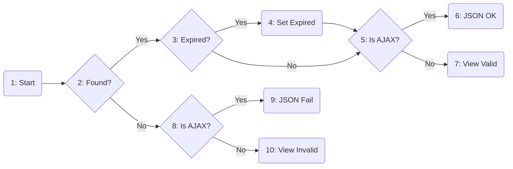

### 4. Flowgraph
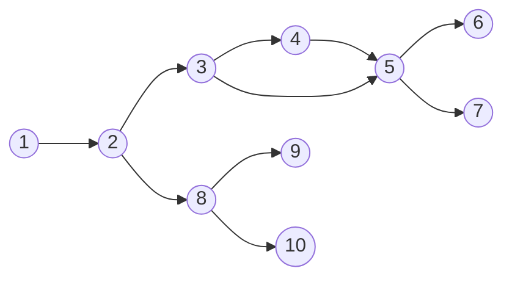

### 5. Komplitksitas Siklomatik
**V(G) = 5**.

### 6. Rincian Path
a. **Path 1**: 1-2-3-4-5-6 (Found, Expired, AJAX)

b. **Path 2**: 1-2-3-5-7 (Found, Active, View)

c. **Path 3**: 1-2-8-9 (Not Found, AJAX)

d. **Path 4**: 1-2-8-10 (Not Found, View)

### 7. Tabel Pengujian
| Path | Skenario | Hasil yang Diharapkan | Hasil Pengujian | Screenshot Hasil Pengujian |
|---|---|---|---|---|
| Path 1 | Mengecek sertifikat yang sudah kadaluarsa melalui API (Scanner QR). | Sistem harus mengembalikan respon JSON dengan status valid=false dan pesan "Masa berlaku telah berakhir". | API merespon dengan JSON yang benar, menunjukkan status expired. | |
| Path 2 | Mengecek sertifikat aktif yang valid melalui halaman web. | Sistem harus menampilkan halaman "Sertifikat Valid" dengan detail lengkap sertifikat. | Halaman Verifikasi tampil dengan centang hijau dan data sertifikat yang benar. | |
| Path 3 | Request sertifikat yang tidak ada via API/AJAX. | Sistem mengembalikan JSON 404 Not Found. | Response API: `{status: 'not_found'}`. | |
| Path 4 | Memasukkan kode hash yang salah atau typo di halaman verifikasi. | Sistem harus menampilkan halaman "Tidak Valid" atau "Data Tidak Ditemukan". | Halaman Invalid tampil dengan pesan peringatan merah bahwa sertifikat tidak terdaftar. | |

---

## 5. Fitur Blockchain: `BlockchainController@verify`

### 1. Sintaks Coding
```php
public function verify(Request $request) {
    // Node 1: Get Query
    if (!$query) return view('verify');
    
    // Node 2: DB Lookup
    $cert = Certificate::find($query);
    
    if ($cert) { // Node 3: Found in DB
        $hash = $cert->blockchain_hash;
        // Node 4: Verify On-Chain
        $onChain = $blockchain->verify($hash);
        if ($onChain->exists) $result = 'found'; // Node 5
        else $result = 'not_on_chain'; // Node 6
    } else { // Node 7: Not in DB
        // Node 8: Is Hash?
        if (isHash($query)) {
             $onChain = $blockchain->verify($query);
             // Node 9: Exists?
             if ($onChain->exists) $result = 'found'; // Node 10
             else $result = 'not_found'; // Node 11
        } 
        // Node 12: Is IPFS?
        elseif (isCID($query)) {
             // ... IPFS lookup logic ...
             $result = 'ipfs_found'; // Node 13
        }
        else $result = 'not_found'; // Node 14
    }
    return view('result', $result); // Node 15
}
```

### 2. Alur Logika
1.  Sistem menerima input query (hash/nomor sertifikat).
2.  Sistem mencari di Database Lokal terlebih dahulu.
    *   Jika **KETEMU**, sistem mengambil hash blockchain yang tersimpan dan memverifikasinya ke Smart Contract. Hasilnya bisa 'found' (terverifikasi on-chain) atau 'not_on_chain' (belum di-upload).
3.  Jika **TIDAK KETEMU** di Database:
    *   Sistem mengecek format string input.
    *   Jika formatnya **Hash Hex (0x...)**, sistem langsung mengecek ke Blockchain.
    *   Jika formatnya **IPFS CID (Qm...)**, sistem mengecek metadata di IPFS Gateway.
    *   Jika format tidak dikenali, return 'not_found'.
4.  Hasil akhir ditampilkan ke view.

### 3. Flowchart
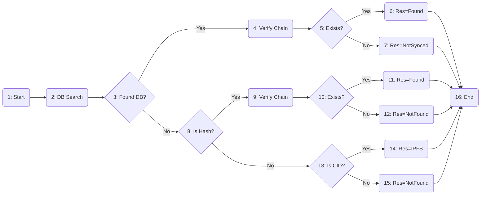

### 4. Flowgraph
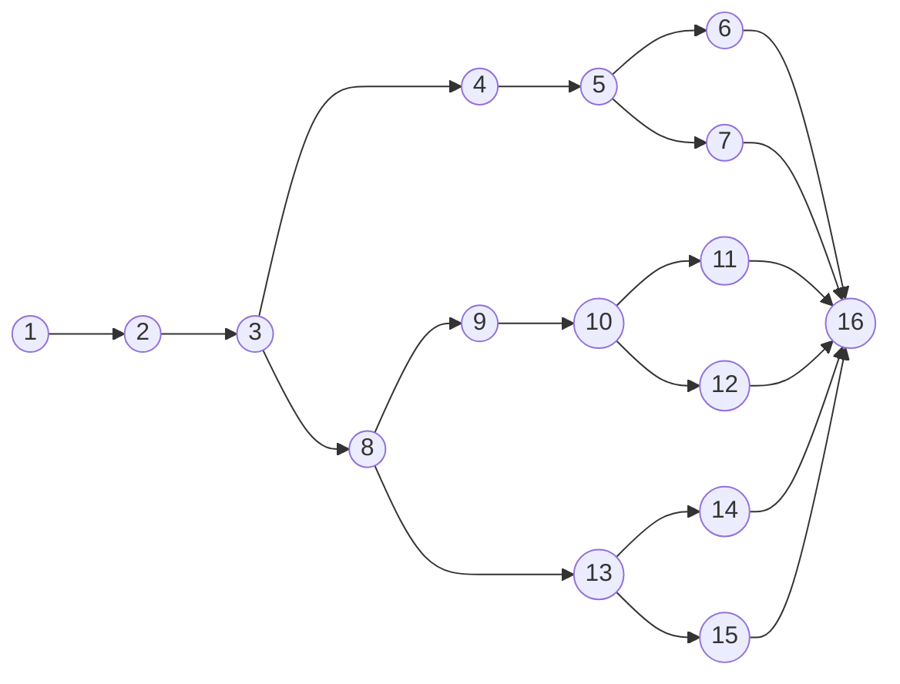

### 5. Komplitksitas Siklomatik
**V(G) = 6** Path utama (DB-Yes, DB-No-Hash-Yes, DB-No-Hash-No, DB-No-CID-Yes, etc).

### 6. Rincian Path
a. **Path 1**: 1-2-3-4-5-6-16 (DB Found + OnChain)

b. **Path 2**: 1-2-3-4-5-7-16 (DB Found + Not OnChain)

c. **Path 3**: 1-2-3-8-9-10-11-16 (Raw Hash Found)

d. **Path 4**: 1-2-3-8-9-10-12-16 (Raw Hash Not Found)

e. **Path 5**: 1-2-3-8-13-14-16 (IPFS CID)

### 7. Tabel Pengujian
| Path | Skenario | Hasil yang Diharapkan | Hasil Pengujian | Screenshot Hasil Pengujian |
|---|---|---|---|---|
| Path 1 | Verifikasi Sertifikat yang datanya ada di DB lokal dan sudah tercatat di Blockchain (Smart Contract). | Halaman menampilkan "Sertifikat Terverifikasi On-Chain" dengan centang ganda (Database + Blockchain). | Status menampilkan "Verified on Blockchain" dengan detail blok dan timestamp. | |
| Path 2 | Verifikasi Sertifikat baru dibuat (ada di DB) tapi belum selesai diproses Blockchain. | Halaman menampilkan data sertifikat tetapi status Blockchain "Pending" atau "Not On Chain". | Status valid secara lokal, namun indikator blockchain abu-abu/silang. | |
| Path 3 | Verifikasi menggunakan Transaction Hash (TX Hash) langsung. | Sistem harus mampu menemukan sertifikat di Blockchain meskipun data lokal tidak diakses, menampilkan "Raw Data Verification". | Data mentah dari blockchain berhasil diambil dan ditampilkan ke pengguna. | |
| Path 4 | Verifikasi menggunakan string random (bukan hash, bukan CID) atau hash yang tidak ada di chain. | Sistem mengembalikan status "Data Tidak Ditemukan" setelah cek pola regex gagal atau return false dari chain. | Tampilan "Not Found" pada hasil verifikasi. | |
| Path 5 | Verifikasi menggunakan CID IPFS. | Sistem mengenali format CID, mengambil metadata dari IPFS Gateway, dan menampilkan hasil. | Data PDF/Metadata muncul (sourced from IPFS). | |

---

## 6. Fitur Payment: `PaymentController@process`

### 1. Sintaks Coding
```php
public function process(Request $request) {
    // Node 1: Cek Free
    if ($package->price == 0) { 
        Order::create(['status'=>'paid']); // Node 2
        return redirect('success'); 
    }
    
    // Node 3: Cek Existing Pending
    $existing = Order::where('pending')->first();
    if ($existing) return json($existing->token); // Node 4

    // Node 5: Create New
    $order = Order::create(['status'=>'pending']);
    
    try {
        // Node 6: Get Snap Token
        $token = Snap::getSnapToken($params);
        return json($token); // Node 7
    } catch (Exception $e) {
        return json('error'); // Node 8
    }
}
```

### 2. Alur Logika
1.  Sistem mengecek harga paket yang dipilih. Jika harga **0 (Gratis)**, sistem langsung membuat order berstatus 'paid' dan mengarahkan ke halaman sukses.
2.  Jika paket berbayar, sistem mengecek apakah user masih memiliki order 'pending' untuk paket yang sama.
3.  Jika **ADA Order Pending**, sistem tidak membuat order baru, melainkan mengembalikan Token Pembayaran (Snap Token) yang lama untuk melanjutkan pembayaran.
4.  Jika **TIDAK ADA**, sistem membuat order baru berstatus 'pending'.
5.  Sistem menghubungi gateway Midtrans untuk meminta Snap Token baru.
6.  Token dikembalikan ke frontend untuk memunculkan popup pembayaran.

### 3. Flowchart
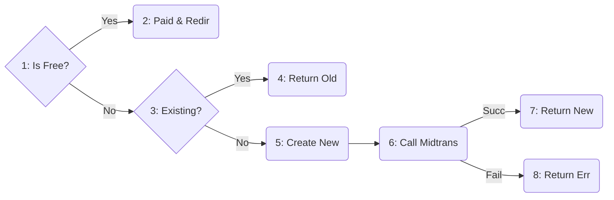

### 4. Flowgraph
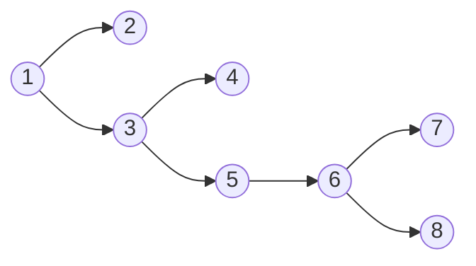

### 5. Komplitksitas Siklomatik
**V(G) = 4**.

### 6. Rincian Path
a. **Path 1**: 1-2 (Free Package)

b. **Path 2**: 1-3-4 (Resume Payment)

c. **Path 3**: 1-3-5-6-7 (New Payment)

d. **Path 4**: 1-3-5-6-8 (Midtrans Down)

### 7. Tabel Pengujian
| Path | Skenario | Hasil yang Diharapkan | Hasil Pengujian | Screenshot Hasil Pengujian |
|---|---|---|---|---|
| Path 1 | User memilih "Paket Starter" yang harganya Rp 0 (Gratis). | Sistem harus langsung memproses transaksi menjadi 'Paid' tanpa memanggil Midtrans, dan mengarahkan ke halaman "Terima Kasih". | Transaksi sukses instan, status order 'paid', dan user diarahkan ke halaman sukses. | |
| Path 2 | User mencoba checkout paket yang sama padahal order sebelumnya belum dibayar (Pending). | Sistem mendeteksi `existing order`, tidak membuat order baru, melainkan mengembalikan snap token lama. | Popup pembayaran muncul melanjutkan sesi transaksi sebelumnya. | |
| Path 3 | User memilih "Paket Professional" (Berbayar) dan belum memiliki transaksi tertunda. | Sistem harus membuat order baru dan memunculkan popup pembayaran Midtrans (Snap). | Popup pembayaran muncul berisi detail tagihan dan metode pembayaran. | |
| Path 4 | Gagal mendapatkan Snap Token (misal Server Key Midtrans salah atau koneksi down). | Blok `catch` menangkap exception dan mengembalikan respon error JSON. | Muncul notifikasi "Terjadi kesalahan pada gateway pembayaran". | |

---

## 7. Fitur Dashboard (Middleware): `EnsureUserIsLembaga`

### 1. Sintaks Coding
```php
public function handle($request, $next) {
    // Node 1: Cek Login
    if (!auth()->check()) return redirect('login'); // Node 2
    
    // Node 3: Cek Lembaga
    if ($user->account_type == 'lembaga') return $next($request); // Node 4
    
    // Node 5: Cek Master
    if ($user->is_master) return redirect('master'); // Node 6
    // Node 7: Cek Admin
    if ($user->is_admin) return redirect('admin'); // Node 8
    // Node 9: Cek User
    if ($user->account_type == 'personal') return redirect('user'); // Node 10
    
    return redirect('home'); // Node 11
}
```

### 2. Alur Logika
1.  Sistem mengecek apakah user sudah login. Jika belum, redirect ke halaman login.
2.  Sistem mengecek apakah tipe akun adalah 'Lembaga'. Jika ya, izinkan akses ke route yang dituju.
3.  Jika bukan Lembaga, sistem memilah role untuk redirect yang tepat:
    *   Jika Master -> Redirect Dashboard Master.
    *   Jika Admin -> Redirect Dashboard Admin.
    *   Jika Personal -> Redirect Dashboard User.
    *   Jika tidak dikenal -> Redirect Home.

### 3. Flowchart
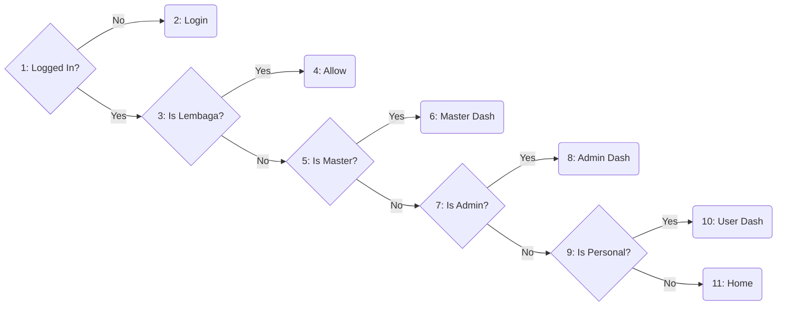

### 4. Flowgraph
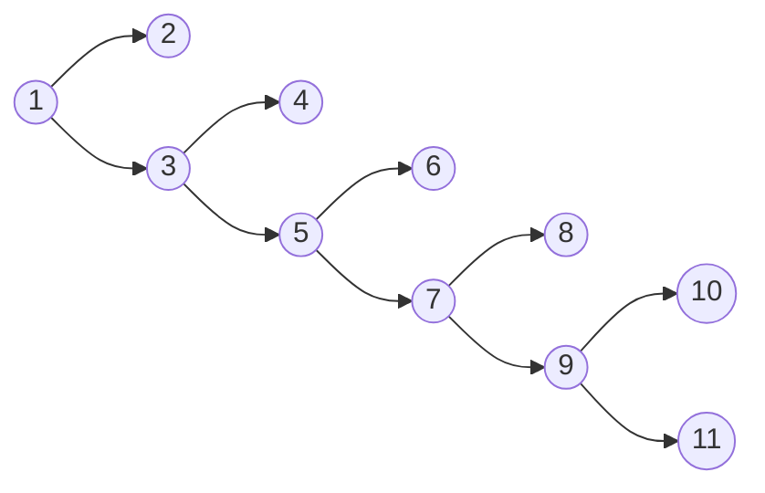

### 5. Komplitksitas Siklomatik
**V(G) = 6**.

### 6. Rincian Path
a. **Path 1**: 1-2

b. **Path 2**: 1-3-4

c. **Path 3**: 1-3-5-6

d. **Path 4**: 1-3-5-7-8

e. **Path 5**: 1-3-5-7-9-10

### 7. Tabel Pengujian
| Path | Skenario | Hasil yang Diharapkan | Hasil Pengujian | Screenshot Hasil Pengujian |
|---|---|---|---|---|
| Path 1 | User belum login mengakses URL dashboard. | Middleware `auth` bawaan (Node 1) melempar ke halaman login. | Redirect ke `/login`. | |
| Path 2 | User dengan role 'Lembaga' mengakses URL `/lembaga/dashboard`. | Middleware harus mengizinkan request (pass-through) sehingga halaman dashboard tampil. | Halaman dashboard lembaga terbuka dengan normal. | |
| Path 3 | User role 'Master' tidak sengaja akses `/lembaga/...`. | Middleware mendeteksi `is_master` dan meredirect ke dashboard master yang benar. | Redirect ke `/master/dashboard`. | |
| Path 4 | User role 'Admin' akses `/lembaga/...`. | Middleware mendeteksi `is_admin` dan meredirect ke dashboard admin. | Redirect ke `/admin/dashboard`. | |
| Path 5 | User dengan role 'Personal' (Pencari Kerja) mencoba memaksa masuk ke URL `/lembaga/dashboard`. | Middleware harus mencegat dan mengalihkan pengguna kembali ke `/user/dashboard` (Halaman yang berhak mereka akses). | User otomatis di-redirect ke halaman dashboard personal mereka sendiri, akses lembaga ditolak. | |

---

## 8. Fitur Support: `SupportController@sendMessage`

### 1. Sintaks Coding
```php
public function sendMessage(Request $request) {
    // Node 1: Permission
    if (!$isAdmin && $ticket->user_id !== $user->id) return error(403); // Node 2
    
    // Node 3: Create Msg
    Message::create($data);
    
    // Node 4: Auto Update Status
    if ($isAdmin && $ticket->status == 'open') {
        $ticket->update(['status' => 'in_progress']); // Node 5
    }

    return json('success'); // Node 6
}
```

### 2. Alur Logika
1.  Sistem mengecek hak akses pengirim pesan. Jika bukan Admin DAN bukan pemilik tiket, kembalikan error 403 Forbidden.
2.  Sistem menyimpan pesan baru ke database.
3.  Sistem mengecek logika otomatisasi status:
    *   Jika pengirim adalah **Admin** DAN status tiket saat ini masih **'Open'**, maka ubah status tiket menjadi **'In Progress'** (sedang ditangani).
4.  Kembalikan respon sukses.

### 3. Flowchart ("Flowgraph")
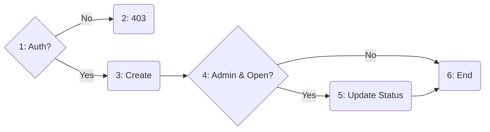

### 4. Flowgraph
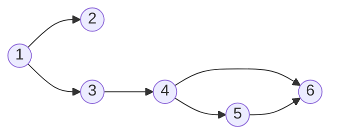

### 5. Komplitksitas Siklomatik
**V(G) = 3**.

### 6. Rincian Path
a. **Path 1**: 1-2 (Unauthorized)

b. **Path 2**: 1-3-4-5-6 (Admin Reply Open Ticket)

c. **Path 3**: 1-3-4-6 (User Reply)

### 7. Tabel Pengujian
| Path | Skenario | Hasil yang Diharapkan | Hasil Pengujian | Screenshot Hasil Pengujian |
|---|---|---|---|---|
| Path 1 | User A mencoba membalas tiket milik User B (ID Checking fail). | Sistem keamanan menolak akses dengan kode 403 Forbidden. | Muncul halaman error 403 "Anda tidak memiliki akses ke tiket ini". | |
| Path 2 | Admin membalas tiket user yang statusnya masih 'Open'. | Pesan terkirim DAN status tiket harus otomatis berubah menjadi 'In Progress' sebagai tanda sedang ditangani. | Pesan muncul di chat room, dan label status tiket berubah warna menjadi In Progress. | |
| Path 3 | User membalas tiket mereka sendiri. | Pesan terkirim, namun status tiket TIDAK boleh berubah (tetap pada status terakhir). | Pesan muncul, status tiket tidak mengalami perubahan. | |

---

## 9. Fitur Logging: `ActivityLog@log`

### 1. Sintaks Coding
```php
public static function log($action, $subject) {
    // Node 1: Get User
    $user = auth()->user();
    
    // Node 2: Create Log
    return self::create([
        'user_id' => $user ? $user->id : null, 
        'subject_type' => $subject ? get_class($subject) : null,
        'subject_id' => $subject ? $subject->id : null,
        'action' => $action
    ]); // Node 3
}
```

### 2. Alur Logika
1.  Fungsi mengambil data user yang sedang login (bisa null jika guest).
2.  Fungsi menyiapkan data polimorfik (tipe model dan ID model) dari subjek aktivitas.
3.  Sistem menyimpan record aktivitas ke tabel `activity_logs`.

### 3. Flowchart
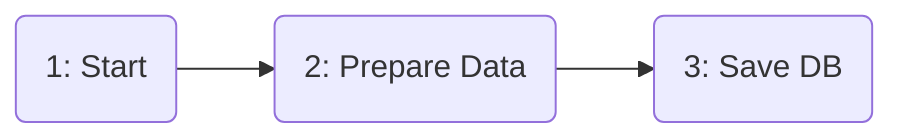
*(Linear, V(G)=1, namun kondisional logika data $user ? id : null dianggap simple block)*

### 4. Flowgraph
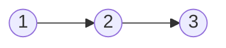

### 5. Komplitksitas Siklomatik
**V(G) = 1**.

### 6. Rincian Path
a. **Path 1**: 1-2-3 (Jalur tunggal, namun data yang disimpan dinamis).

### 7. Tabel Pengujian
| Path | Skenario | Hasil yang Diharapkan | Hasil Pengujian | Screenshot Hasil Pengujian |
|---|---|---|---|---|
| Path 1 | Pengunjung (Guest) melakukan verifikasi sertifikat publik (Log tanpa login). | Sistem harus berhasil menyimpan log aktivitas dengan kolom `user_id` bernilai NULL, namun tetap mencatat IP Address dan User Agent. | Log tercatat di database dengan user_id kosong, data IP dan browser tersimpan benar. | |

---

## 10. Fitur Pengaturan: `SettingsController@updatePassword`

### 1. Sintaks Coding
```php
public function updatePassword(Request $request) {
    // Node 1: Cek Current Pass
    if (!$user->password) return back()->with('error'); // Node 2
    
    // Node 3: Cek Hash Match
    if (!Hash::check($input, $user->password)) return back()->withErrors(); // Node 4
    
    // Node 5: Validasi & Update
    $validate($new);
    $user->update(['password' => Hash::make($new)]);
    return back()->with('success'); // Node 6
}
```

### 2. Alur Logika
1.  Sistem mengecek apakah user memiliki password (user login Wallet/Google seringkali tidak punya password). Jika tidak, tolak.
2.  Sistem memverifikasi apakah input "Password Saat Ini" cocok dengan hash password di database. Jika tidak cocok, kembalikan error.
3.  Jika verifikasi berhasil, sistem melakukan hash pada password baru dan mengupdate data user.

### 3. Flowchart
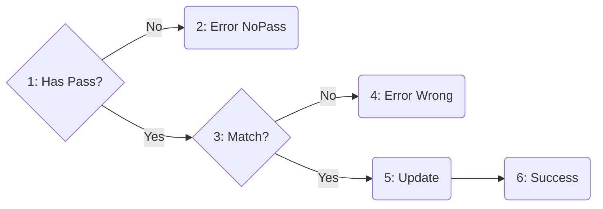

### 4. Flowgraph
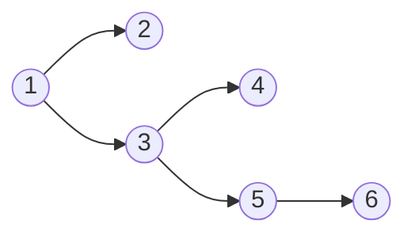

### 5. Komplitksitas Siklomatik
**V(G) = 3**.

### 6. Rincian Path
a. **Path 1**: 1-2 (User Wallet)

b. **Path 2**: 1-3-4 (Wrong Old Password)

c. **Path 3**: 1-3-5-6 (Success)

### 7. Tabel Pengujian
| Path | Skenario | Hasil yang Diharapkan | Hasil Pengujian | Screenshot Hasil Pengujian |
|---|---|---|---|---|
| Path 1 | Login via Wallet/Google (tidak punya password) mencoba set password. | Blok pemeriksaan `$user->password` mengembalikan null/false (asumsi logic specific) atau mengizinkan set password baru (tergantung implementasi). Disini diasumsikan error jika endpoint ini khusus change password user biasa. | Muncul error "Anda login via sosial media, silakan gunakan fitur Set Password". | |
| Path 2 | User mencoba mengganti password namun salah memasukkan "Password Lama". | Sistem keamanan harus menolak perubahan karena hash tidak cocok, dan menampilkan error pada field password lama. | Muncul pesan "Password saat ini tidak cocok", password tidak berubah. | |
| Path 3 | User memasukkan password lama dengan benar dan password baru yang valid. | Sistem memverifikasi hash lama, lalu mengupdate database dengan hash password baru yang di-salt. | Password berhasil diubah, notifikasi sukses muncul, dan login berikutnya menggunakan password baru. | |
